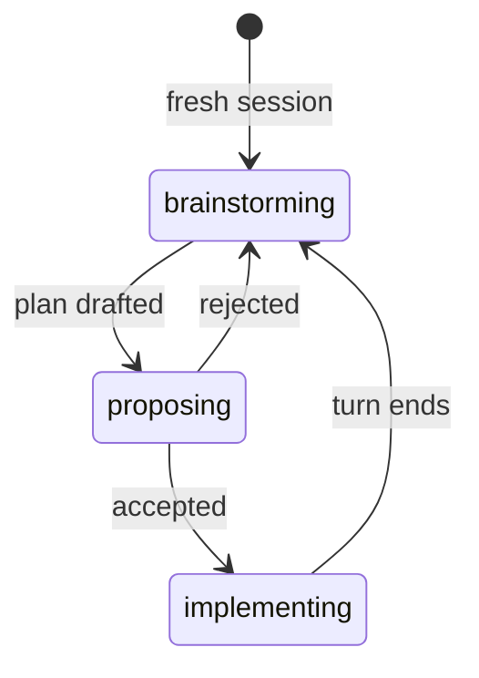

# pi-plan-mode

Plan mode for the [pi coding agent](https://github.com/earendil-works/pi): gated brainstorming, plan proposals with an approval dialog, and time-boxed implementation windows.

## How it works



`Ctrl+Alt+P` moves one step forward manually at any point; `/plan disable` exits to `off` from any state.

- **brainstorming** — every fresh session starts here, read-only: `edit`/`write` are removed and bash is gated to a read-only allowlist. Explore and discuss, then run `/plan create` for a formal plan.
- **proposing** — the drafted plan is presented with a dialog: **Implement now**, **Back to brainstorming** (keep refining), or **Esc** (decide later).
- **implementing** — full tools. When the agent's turn ends, the extension automatically returns to **brainstorming**. Plan steps are kept so work can resume.
- **off** — `/plan disable` exits plan mode entirely.

State persists across session restarts.

## Commands and keys

| Input           | Action                                                                                                                           |
| --------------- | -------------------------------------------------------------------------------------------------------------------------------- |
| `Ctrl+Alt+P`    | Cycle `brainstorming → proposing → implementing → brainstorming` (guarded: advancing from brainstorming requires a drafted plan) |
| `/plan`         | Enter brainstorming (from `off`)                                                                                                 |
| `/plan create`  | Ask the agent to draft the formal plan                                                                                           |
| `/plan disable` | Exit plan mode                                                                                                                   |

## Install

```bash
pi install npm:@phrmendes/pi-plan-mode
```

## Development

```bash
devenv shell      # optional: node + pnpm + tsgo (compiler & LSP)
pnpm install
pnpm test         # node:test suite, no framework
pnpm run typecheck
```

## License

Apache-2.0 — see [LICENSE](./LICENSE).
