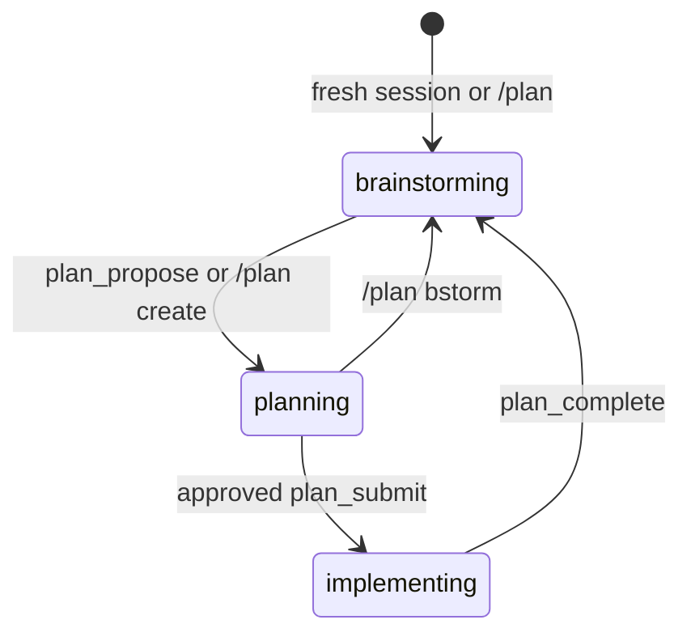

# pi-plan-mode

Agent-driven plan mode for the [pi coding agent](https://github.com/earendil-works/pi), with read-only discovery, structured approval, and durable implementation sessions.

## Flow



The agent normally advances the workflow through typed control tools:

- `plan_propose` enters planning after the user requests a proposal.
- `plan_submit` sends structured files and work items for approval.
- `plan_approve` reopens approval for a stored proposal without resubmission.
- `plan_complete` ends implementation after all work is verified.

Implementation remains active across retries and user turns. Approval applies to the accepted proposal, not only one agent run. `plan_complete` must run separately after all implementation and verification tools finish.

## Manual fallbacks

The `/plan` command is always registered. Its argument suggestions depend on the current phase.

| Phase         | Available input                 |
| ------------- | ------------------------------- |
| Off           | `/plan`                         |
| Brainstorming | `/plan create`, `/plan disable` |
| Planning      | `/plan bstorm`, `/plan disable` |
| Implementing  | `/plan disable`                 |

Invalid phase transitions are rejected.

## Permissions

Brainstorming and planning expose only `read`, gated `bash`, and the control tool for the current phase. Bash commands must match a conservative inspection allowlist.

Implementation restores the tools captured when plan mode started and adds `plan_complete`. Disabling plan mode restores the captured tools. Before reload, new, resume, or fork, the old runtime also restores the captured tools. Restoring an already disabled session does not change current tools.

The bash gate reduces accidental writes. It is not a security sandbox. Commands still run with the user's permissions, so install only extensions that you trust.

## State and prompts

The current phase, structured proposal, and original tool snapshot persist on the active session branch. Invalid persisted data is normalized during startup.

Phase instructions are compact, turn-local system-prompt additions. They are not stored as conversation messages or discoverable pi skills.

A proposal submitted without a UI remains in planning. In a UI-capable session, `plan_approve` can approve it without submitting the proposal again.

## Install

```bash
pi install npm:@phrmendes/pi-plan-mode
```

## Development

```bash
devenv shell
pnpm install
pnpm test
pnpm run typecheck
pnpm run format:check
```

## Runtime checks

Before a release, verify these flows in the real pi TUI:

- Enter and disable plan mode.
- Reload while brainstorming.
- Start a new session while planning.
- Resume and approve a stored proposal with `plan_approve`.
- Confirm that `plan_complete` is rejected while another tool runs.

Verify package contents with:

```bash
pnpm run pack:check
```

## License

Apache-2.0 — see [LICENSE](./LICENSE).
