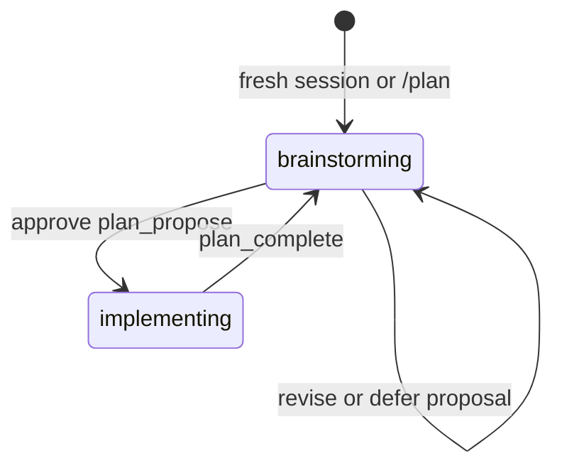

# pi-plan-mode

Agent-driven plan mode for the [pi coding agent](https://github.com/earendil-works/pi), with restricted discovery, structured proposal review, and durable implementation sessions.

## Flow



The agent uses three control tools:

- `plan_ask` asks one or more multiple-choice clarification questions, with a free-text fallback.
- `plan_propose` submits one complete engineering proposal for review and approval.
- `plan_complete` ends implementation after all work and verification finish.

The agent submits structured proposal data once. The extension stores it, formats it as Markdown, shows the complete proposal, and asks the user to approve, revise, or keep it for later. Approval immediately queues implementation without another user message.

A brief PRD covers the problem, outcome, approach, concrete file or area changes, and acceptance criteria.

## Manual controls

| State         | Command         | Result                            |
| ------------- | --------------- | --------------------------------- |
| Off           | `/plan`         | Enter restricted brainstorming    |
| Brainstorming | `/plan review`  | Reopen a stored deferred proposal |
| Enabled       | `/plan disable` | Exit plan mode and restore tools  |

Invalid transitions are rejected. `/plan review` reports when no proposal is stored.

## Proposal review

The extension renders proposals in a stable Markdown order:

1. Problem
2. Outcome
3. Approach
4. Changes
5. Acceptance criteria

In a UI session, the review choices are:

- **Approve and implement** — enable saved tools and start implementation.
- **Request revision** — clear the proposal and continue brainstorming.
- **Keep for later** — preserve the proposal for `/plan review`.

Without a UI, the tool returns the formatted proposal and stores it for later review.

## Permissions

Brainstorming exposes only `read`, gated `bash`, `plan_ask`, and `plan_propose`. Bash commands must match a conservative inspection allowlist.

Implementation restores the tools captured when plan mode started and adds `plan_complete`. Disabling plan mode restores the captured tools. Before reload, new, resume, or fork, the old runtime also restores them.

The Bash gate reduces accidental writes. It is not a security sandbox. Package-manager verification scripts can execute arbitrary project-defined commands. Install only extensions and inspect only projects that you trust.

## State and migration

The current phase, pending or approved proposal, and original tool snapshot persist on the active session branch. Legacy planning sessions restore as brainstorming. Valid legacy proposals are converted to the current engineering proposal format.

Phase instructions are compact, turn-local system-prompt additions. They are not stored as conversation messages or exposed as pi skills.

## Install

```bash
pi install npm:@phrmendes/pi-plan-mode
```

## Development

```bash
devenv shell
pnpm install
pnpm test
pnpm run typecheck
pnpm run format:check
pnpm run pack:check
```

Before release, verify approval, revision, deferral, `/plan review`, reload, resume, non-UI submission, and completion in a real pi session.

## License

Apache-2.0 — see [LICENSE](./LICENSE).
