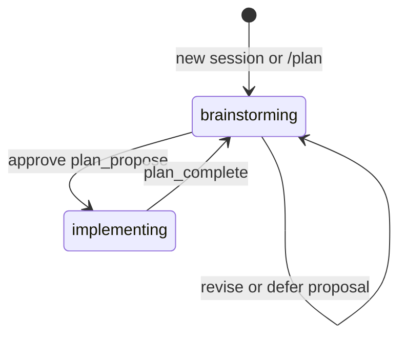

# pi-plan-mode

Plan mode for the [pi coding agent](https://github.com/earendil-works/pi).

Plan mode provides:

- Restricted project inspection.
- Structured proposal review.
- Persistent implementation sessions.

## Workflow


```mermaid
stateDiagram-v2
    [*] --> brainstorming : new session or /plan
    brainstorming --> brainstorming : revise or defer proposal
    brainstorming --> implementing : approve plan_propose
    implementing --> brainstorming : plan_complete
```

The agent uses three control tools:

- `plan_ask` asks one or more choice questions.
- `plan_propose` submits one complete proposal for review.
- `plan_complete` ends implementation after all checks pass.

The extension stores the proposal. It displays the proposal as Markdown in the conversation. The display does not enter the model context. The extension then asks the user to choose an action.

A proposal contains these sections, in this order:

1. Problem
2. Outcome
3. Approach
4. Changes
5. Acceptance criteria

The review actions are:

- **Approve and implement** — enable the saved tools and start implementation.
- **Request revision** — remove the proposal and continue brainstorming.
- **Keep for later** — save the proposal for `/plan review`.

After **Request revision**, plan mode waits for user feedback. The agent cannot ask questions or submit another proposal until the user sends a message with the required changes.

Without a UI, the tool returns the formatted proposal and saves it for later review.

## Commands

| State         | Command         | Result                                      |
| ------------- | --------------- | ------------------------------------------- |
| Off           | `/plan`         | Enter restricted brainstorming.             |
| Brainstorming | `/plan review`  | Review the saved proposal.                  |
| Enabled       | `/plan disable` | Exit plan mode and restore the saved tools. |

Invalid state changes are rejected. `/plan review` reports when no proposal exists.

## Permissions

During brainstorming, the agent can use only `read`, approved inspection commands through `bash`, `plan_ask`, and `plan_propose`.

The Bash policy allows only commands in a fixed inspection list. It blocks known write operations and unsupported shell syntax.

The Bash policy is not a security sandbox. Package-manager verification commands can run project-defined code. Install extensions and inspect projects only when you trust them.

During implementation, the extension restores the tools saved when plan mode started and adds `plan_complete`. Disabling plan mode restores the saved tools. The extension also restores the tools before session reload, resume, or fork.

## State and migration

The active session branch stores:

- The current phase.
- The saved tools.
- The pending proposal.
- The revision-feedback state.

Legacy planning sessions restore as brainstorming. The extension marks migrated proposals as legacy. A legacy proposal cannot enter implementation directly. Some old sessions do not contain file details. The migration can add synthetic details in this case.

## Install

```bash
pi install npm:@phrmendes/pi-plan-mode
```

## Development

```bash
devenv shell
pnpm install
pnpm test
pnpm test:e2e
pnpm run typecheck
pnpm run format:check
pnpm run pack:check
```

Before release, test approval, revision, deferral, `/plan review`, reload, resume, non-UI submission, and completion in a real pi session.

## License

Apache-2.0. See [LICENSE](./LICENSE).
