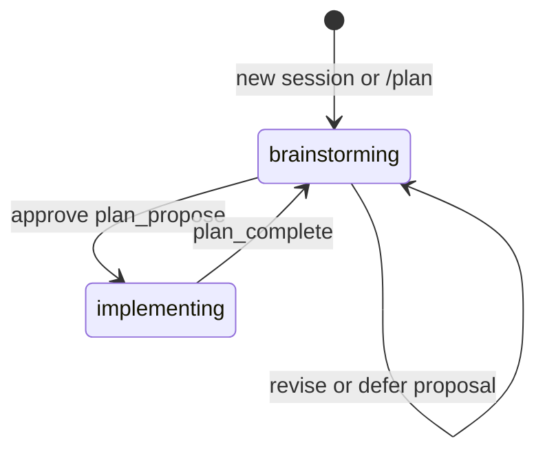

# pi-plan-mode

Plan mode for the [pi coding agent](https://github.com/earendil-works/pi).

It separates repository discovery from implementation:

- **Brainstorming**: inspect the project and prepare a proposal.
- **Implementing**: available after the user approves the proposal.


```mermaid
stateDiagram-v2
    [*] --> brainstorming : new session or /plan
    brainstorming --> brainstorming : revise or defer proposal
    brainstorming --> implementing : approve plan_propose
    implementing --> brainstorming : plan_complete
```

## Workflow

The agent uses three control tools:

- `plan_ask` — ask choice questions before proposing.
- `plan_propose` — submit one complete proposal for review.
- `plan_complete` — finish approved implementation after checks pass.

A proposal contains:

1. Problem
2. Outcome
3. Approach
4. Changes
5. Acceptance criteria

In a UI session, the user can approve, request revision, or keep the proposal for later. After revision, the agent waits for feedback before asking questions or submitting another proposal.

## Commands

| State         | Command         | Result                                         |
| ------------- | --------------- | ---------------------------------------------- |
| Off           | `/plan`         | Enter brainstorming.                           |
| Brainstorming | `/plan review`  | Review the stored proposal.                    |
| Enabled       | `/plan disable` | Exit plan mode and restore the original tools. |

## Permissions

During brainstorming, the agent can use:

- `read`
- the read-only `nushell` tool
- `plan_ask`
- `plan_propose`

Editing tools and Bash are not active before approval. After approval, the saved implementation tools are restored together with `nushell` and `plan_complete`.

The Nushell policy is a workflow guard, not a security sandbox. Use a VM for security. Each Nushell call runs in a separate process, so use explicit paths instead of relying on `cd` from an earlier call.

## Install

```bash
pi install npm:@phrmendes/pi-plan-mode
```

## Development

```bash
pnpm install
pnpm test
pnpm test:e2e
pnpm run typecheck
pnpm run format:check
pnpm run pack:check
```

Before release, test approval, revision, deferral, review, reload, resume, non-UI submission, and completion in a real pi session.

## License

Apache-2.0. See [LICENSE](./LICENSE).
