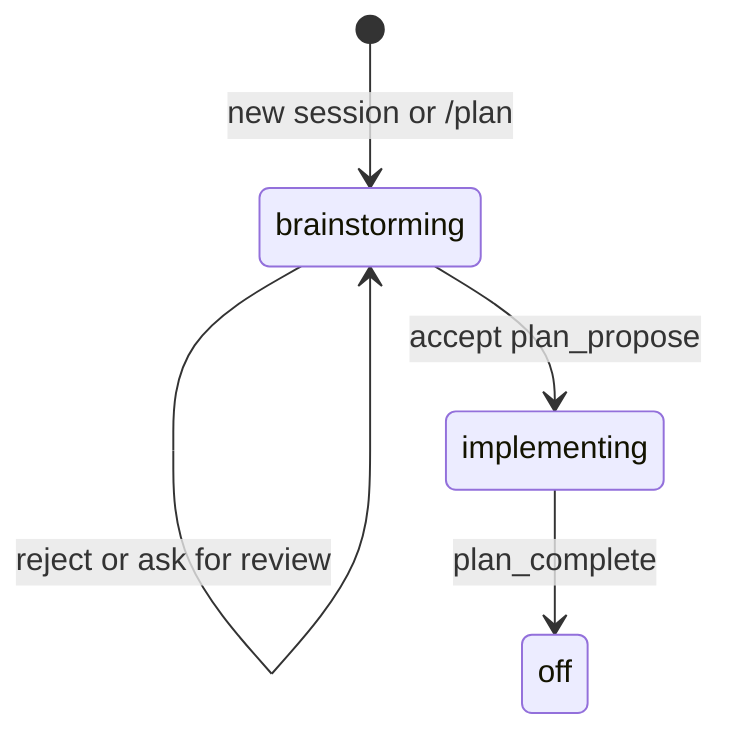

# pi-plan-mode

Plan mode for the [pi coding agent](https://github.com/earendil-works/pi).

It separates repository discovery from implementation:

- **Brainstorming**: inspect the project and prepare a proposal.
- **Implementing**: available after the user accepts the proposal.


```mermaid
stateDiagram-v2
    [*] --> brainstorming : new session or /plan
    brainstorming --> brainstorming : reject or ask for review
    brainstorming --> implementing : accept plan_propose
    implementing --> off : plan_complete
```

## Workflow

The agent uses three control tools:

- `plan_ask` — ask choice questions before proposing.
- `plan_propose` — submit one complete proposal for review, including the changes and any tests worth adding.
- `plan_complete` — finish accepted implementation, then disable plan mode.

A proposal contains:

1. A short description.
2. A list of changes, one per file or area, with a small concrete example where it helps.
3. Tests worth adding or updating, only when they make sense: they must cover real behavior rather than restate existing coverage.

In a UI session, the user can accept and implement, reject, or ask for review. After a rejection, the agent waits for feedback before asking questions or submitting another proposal. Any message you send after a rejection counts as that feedback and lets the agent continue.

The plan phase follows the session tree: navigating to another branch restores the phase and tools that branch had.

## Commands

| State         | Command         | Result                                         |
| ------------- | --------------- | ---------------------------------------------- |
| Off           | `/plan`         | Enter brainstorming.                           |
| Brainstorming | `/plan review`  | Review the stored proposal.                    |
| Enabled       | `/plan disable` | Exit plan mode and restore the original tools. |

## Permissions

During brainstorming, the agent can use:

- `read` (full or partial reads)
- `grep`, `ls`, and `find` (read-only search)
- `plan_ask`
- `plan_propose`
- any tool named in `plan.json` or the `allowedTools` option, when the session already has it active

Shell, editing, and MCP tools are not active before acceptance. After acceptance, the saved tools are restored together with `plan_complete`. `plan_complete` disables plan mode.

## Configuration

MCP and other non-builtin tools are blocked during brainstorming unless you allow them. Add them to `~/.pi/agent/plan.json` (the pi agent folder, where `mcp.json` lives):

```json
{
    "allowedTools": ["mcp__agent_browser__*", "mcp__docs__search"]
}
```

- Entries match a tool name exactly, or as a prefix when the entry ends with `*`. A bare `*` is ignored with a warning, because it would allow every tool.
- An allowed tool stays available only if the session has it active, so plan mode never enables a tool you did not start with.
- MCP tools are named `mcp__<server>__<tool>`, with `-` in the server name written as `_`: the server `agent-browser` becomes `mcp__agent_browser__*`.
- Only servers with `"exposure": "direct"` in `mcp.json` can be allowed. Servers on the default `codemode` exposure are reached through the `codemode` tool, and `tool_search` loads `deferred` ones. Plan mode keeps both blocked.
- Servers connect in the background after the session starts. Plan mode re-checks the active tools before every prompt, so a tool that connects later is allowed or removed like any other.
- The file is read when a session starts. Restart the session or run `/reload` after editing it. A missing or empty file means no extra tools, and a malformed one is reported as a warning.

The `allowedTools` option is merged with the file, for extensions that wrap plan mode programmatically:

```ts
import planMode from "@phrmendes/pi-plan-mode";

export default (pi) => planMode(pi, { allowedTools: ["mcp__agent_browser__*"] });
```

## Install

```bash
pi install npm:@phrmendes/pi-plan-mode
```

## Development

```bash
pnpm install
pnpm test
pnpm test:e2e
pnpm run typecheck
pnpm run format:check
pnpm run pack:check
```

Before release, test acceptance, rejection, review, reload, resume, non-UI submission, and completion in a real pi session.

## License

Apache-2.0. See [LICENSE](./LICENSE).
