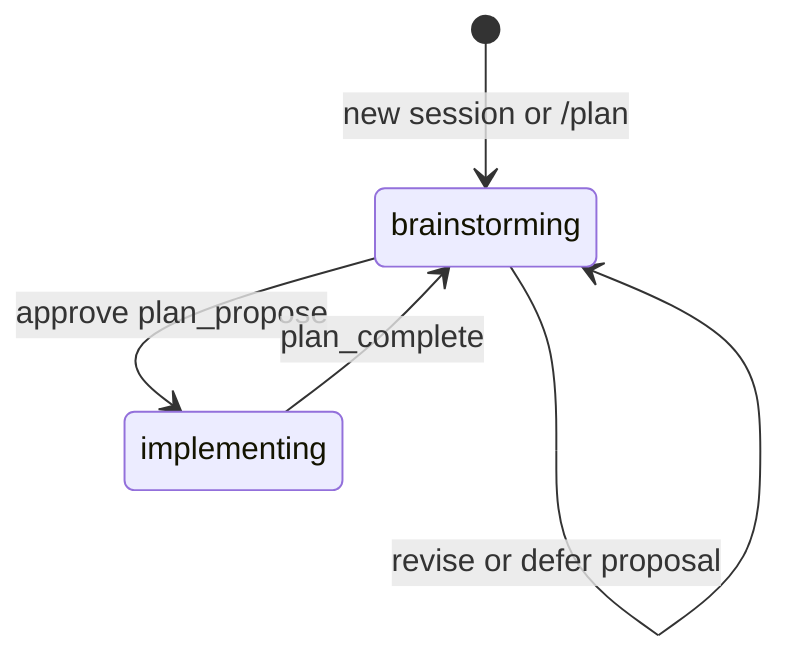

# pi-plan-mode

Plan mode for the [pi coding agent](https://github.com/earendil-works/pi).

Plan mode provides:

- Restricted project inspection.
- Structured proposal review.
- Persistent implementation sessions.

## Workflow


```mermaid
stateDiagram-v2
    [*] --> brainstorming : new session or /plan
    brainstorming --> brainstorming : revise or defer proposal
    brainstorming --> implementing : approve plan_propose
    implementing --> brainstorming : plan_complete
```

The agent uses three control tools:

- `plan_ask` asks one or more choice questions.
- `plan_propose` submits one complete proposal for review.
- `plan_complete` ends implementation after all checks pass.

The extension stores the proposal. It displays the proposal as Markdown in the conversation. The display does not enter the model context. The extension then asks the user to choose an action.

A proposal contains these sections, in this order:

1. Problem
2. Outcome
3. Approach
4. Changes
5. Acceptance criteria

The review actions are:

- **Approve and implement** — enable the saved tools and start implementation.
- **Request revision** — remove the proposal and continue brainstorming.
- **Keep for later** — save the proposal for `/plan review`.

After **Request revision**, plan mode waits for user feedback. The agent cannot ask questions or submit another proposal until the user sends a message with the required changes.

Without a UI, the tool returns the formatted proposal and saves it for later review.

## Commands

| State         | Command         | Result                                      |
| ------------- | --------------- | ------------------------------------------- |
| Off           | `/plan`         | Enter restricted brainstorming.             |
| Brainstorming | `/plan review`  | Review the saved proposal.                  |
| Enabled       | `/plan disable` | Exit plan mode and restore the saved tools. |

Invalid state changes are rejected. `/plan review` reports when no proposal exists.

## Permissions

While plan mode is enabled, `nushell` is the only shell tool. The built-in Bash tool is not active.

During brainstorming, the agent can use only `read`, the read-only `nushell` tool, `plan_ask`, and `plan_propose`. The `nushell` tool accepts direct Nushell source and preserves `|` pipelines. It allows read-only Nushell built-ins and configured read-only external commands such as `git`, `gcloud`, `kubectl`, `uv`, `npm`, `pnpm`, and `ast-grep`. It blocks writes, redirects, package installation, publishing, cloud changes, Kubernetes changes, and other mutations.

During implementation, the extension restores the saved non-shell tools and keeps the same `nushell` tool without the read-only restriction, along with `plan_complete`. Disabling plan mode restores the exact originally saved tools, including Bash when it was present.

The Nushell read-only policy is not a security sandbox. Package-manager verification commands can run project-defined code. Install extensions and inspect projects only when you trust them.

### Planning Nushell subset

Brainstorming supports direct, top-level, read-only Nushell pipelines. It permits ordinary commands joined by `|` and quoted strings containing `|`.

To keep planning inspection simple and read-only, it rejects closures, lists, records, parenthesized command expressions, interpolation, aliases, definitions, imports, overlays, redirects, and nested execution.

## Skills

The package bundles the `nushell` and `ast-grep` skills in `skills/`. Pi discovers package skills automatically. A configured skill with the same name can take precedence.

Their top-level `SKILL.md` files include pi-plan-mode tool contracts for direct `nushell` tool use and phase-specific restrictions. Their reference files remain general on-demand documentation.

## State

The active session branch stores the current durable state:

- The current phase.
- The saved tools.
- The pending proposal.
- The revision-feedback state.

## Install

```bash
pi install npm:@phrmendes/pi-plan-mode
```

## Development

```bash
devenv shell
pnpm install
pnpm test
pnpm test:e2e
pnpm run typecheck
pnpm run format:check
pnpm run pack:check
```

Before release, test approval, revision, deferral, `/plan review`, reload, resume, non-UI submission, and completion in a real pi session.

## License

Apache-2.0. See [LICENSE](./LICENSE).
