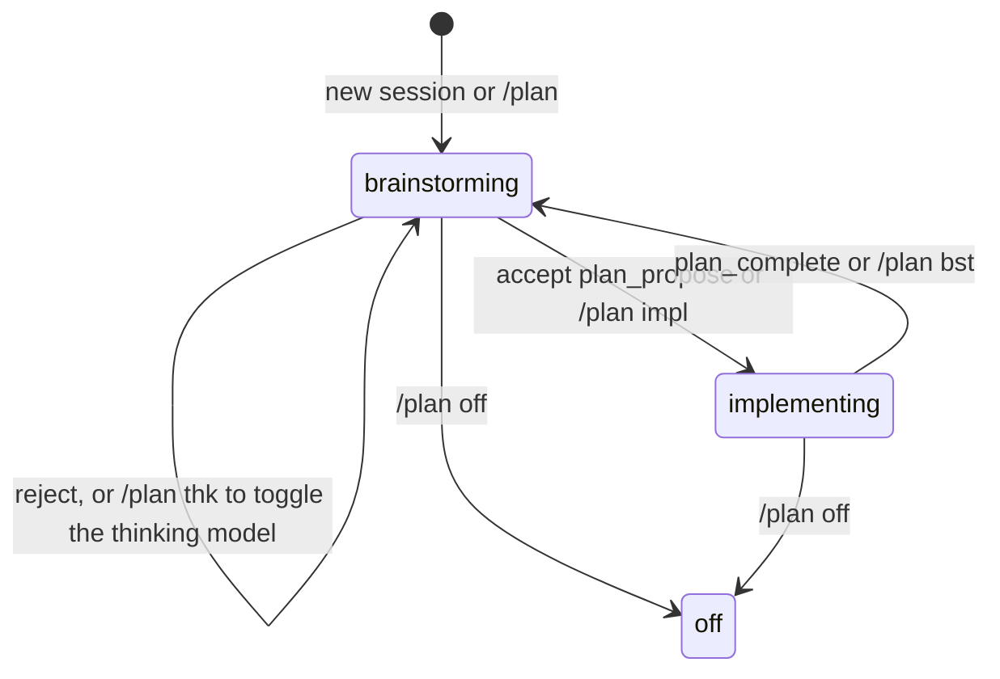

# pi-plan-mode

Plan mode for the [pi coding agent](https://github.com/earendil-works/pi).

It separates repository discovery from implementation:

- **Brainstorming**: inspect the project and prepare a proposal.
- **Implementing**: available after the user accepts the proposal.


```mermaid
stateDiagram-v2
    [*] --> brainstorming : new session or /plan
    brainstorming --> brainstorming : reject, or /plan thk to toggle the thinking model
    brainstorming --> implementing : accept plan_propose or /plan impl
    implementing --> brainstorming : plan_complete or /plan bst
    brainstorming --> off : /plan off
    implementing --> off : /plan off
```

## Workflow

The agent uses three control tools:

- `plan_ask` — ask choice questions before proposing.
- `plan_propose` — submit one complete proposal for review, including the changes and any tests worth adding.
- `plan_complete` — finish an accepted implementation and return to brainstorming for the next cycle; it never turns plan mode off.

The control tools are `model-only`, so `codemode` scripts cannot call them.

A proposal contains:

1. A short description.
2. A list of changes, one per file or area, with a small concrete example where it helps.
3. Tests worth adding or updating, only when they make sense: they must cover real behavior rather than restate existing coverage.

In a UI session, the user can accept and implement, or reject. Closing the review without a choice also rejects. After a rejection, the agent waits for feedback before asking questions or submitting another proposal. Any message you send after a rejection counts as that feedback and lets the agent continue. `/plan bst` works the same way during implementation.

The plan phase follows the session tree: navigating to another branch restores the phase and tools that branch had.

## Commands

| State         | Command                | Result                                                                                                                       |
| ------------- | ---------------------- | ---------------------------------------------------------------------------------------------------------------------------- |
| Off           | `/plan`                | Enter brainstorming.                                                                                                         |
| Brainstorming | `/plan thk`            | Toggle the thinking model on or off. Tools and the deny list stay the same.                                                  |
| Brainstorming | `/plan impl`           | Accept the stored proposal and start implementing, without the review dialog.                                                |
| Implementing  | `/plan bst`            | Stop implementing and return to brainstorming. The proposal is kept for `/plan impl`, and the agent waits for your feedback. |
| Enabled       | `/plan off`            | Exit plan mode and restore the original tools; this is the only way to turn it off.                                          |
| Enabled       | `/plan profile [name]` | List the profiles, or switch the active profile for this session.                                                            |
| Enabled       | `/plan reset`          | Clear model overrides and the session's profile selection and return to the configuration.                                   |

## Permissions

During brainstorming, plan mode denies these tools by default:

- `bash` and `powershell`
- `edit` and `write`

A denied tool is removed from the active tools, and every call to it is blocked, also when a `codemode` script makes the call. All other tools stay available, together with `read`, `grep`, `ls`, and `find`, which plan mode adds for discovery. The plan control tools are `model-only`: the model calls them directly, and `codemode` scripts cannot call them.

After acceptance, the saved tools are restored together with `plan_complete`. When the agent completes the implementation, `plan_complete` returns it to brainstorming and clears the proposal; only `/plan off` exits plan mode.

## Configuration

Plan mode reads two declarative, read-only files:

- `~/.pi/agent/plan.json` (the pi agent folder, where `mcp.json` lives) is the global configuration.
- `.plan.json`, found from the session directory up to the git root, is an optional project override that is read only in a trusted project.

Each file defines profiles. A profile sets a model and thinking level per stage:

```json
{
    "activeProfile": "default",
    "deniedTools": ["mcp__atlassian__executeDestructive"],
    "profiles": {
        "work": {
            "match": ["/mnt/external/work/**"],
            "deniedTools": ["mcp__k8s__k8s_pod_exec", "mcp__atlassian__*"],
            "brainstorming": {
                "model": "bifrost-anthropic/claude-sonnet-5-5",
                "thinkingLevel": "medium",
                "deniedTools": ["task"]
            },
            "thinking": { "model": "bifrost-anthropic/claude-opus-5-5", "thinkingLevel": "high" },
            "implementing": { "model": "bifrost-anthropic/claude-sonnet-5-5", "thinkingLevel": "low" }
        },
        "default": {
            "brainstorming": { "model": "deepseek/deepseek-flash", "thinkingLevel": "high" },
            "thinking": { "model": "deepseek/deepseek-flash", "thinkingLevel": "max" },
            "implementing": { "model": "deepseek/deepseek-flash", "thinkingLevel": "low" }
        }
    }
}
```

- `activeProfile` selects the startup profile. Without it, the first profile whose `match` glob matches the session directory is used, then `default`.
- `thinkingLevel` is one of `off`, `minimal`, `low`, `medium`, `high`, `xhigh`, `max`; pi clamps it to the levels the model supports.
- A legacy top-level `modes` object is treated as `profiles.default`, so older files keep working.

A local `.plan.json` extends the global profiles:

```json
{
    "activeProfile": "work",
    "deniedTools": ["mcp__thisproj__deploy*"],
    "profiles": {
        "work": {
            "extends": "work",
            "implementing": { "model": "bifrost-openai/Huawei/deepseek-v4-pro", "thinkingLevel": "high" }
        },
        "scratch": {
            "brainstorming": { "model": "deepseek/deepseek-flash", "thinkingLevel": "minimal" }
        }
    }
}
```

- A local profile with the same name as a global one extends it: named stages override field by field, unnamed stages and fields are inherited, and deny lists union. An explicit `extends` names the base.
- Local profiles are listed and selected as `<name> (local)` and exist only in that project.
- A name that already ends in `(local)` is rejected, and a circular `extends` chain is reported.

### Deny list

- The effective deny list during brainstorming is the union of the global file's `deniedTools`, the local file's `deniedTools`, the active profile's `deniedTools`, and the stage's `brainstorming.deniedTools`. The lists are additive: you cannot remove a deny.
- Bans apply only during brainstorming. Implementing restores the saved tools untouched.
- Entries match a tool name exactly, or as a prefix when the entry ends with `*`. A bare `*` is ignored with a warning, because it would deny every tool. The plan control tools are never denied.
- MCP tools are named `mcp__<server>__<tool>`, with `-` in the server name written as `_`: the server `agent-browser` becomes `mcp__agent_browser__*`.
- The deny list works for every exposure. Tools on the default `codemode` exposure are reached through `codemode` scripts, and plan mode blocks a denied one there too.
- A deny list allows what it does not name. When you add an MCP server, deny its write tools.

### Models and overrides

- `profiles.<name>.<stage>.model` is `provider/id`. Plan mode splits it on the first `/`, so an id can contain a slash: `bifrost-openai/Huawei/deepseek-v4-pro`.
- When a phase starts, plan mode switches to the model and thinking level of that stage. A stage without a model uses the model you had before plan mode.
- Plan mode saves your model and level before the first switch, and `/plan off` restores them.
- `/plan thk` toggles brainstorming between its stage and the profile's `thinking` stage, for example a cheap model to explore and a stronger one to design. It is available only during brainstorming, keeps the same tools and deny list, and shows `plan: thinking` in the status. Thinking turns off when brainstorming ends. Without a thinking model, `/plan thk` gives a warning and changes nothing.
- A model or thinking level you change with `/model` or `/thinking` while plan mode is on is remembered for the active profile and stage. Plan mode re-applies it on every phase change instead of the configured value, and the status shows `(override)`. The overrides live in the session, not on disk.
- `/plan reset` clears every override and the session's profile selection and returns to the profile chosen by the config files.
- An unknown model, or a model without credentials, gives a warning. The phase still changes, and the current model stays.

The files are read when a session starts and on `/reload`. Nothing writes them. A missing or empty file means no configuration, and every bad value is reported as a warning and ignored. The old `allowedTools` key is no longer supported and is reported.

## Install

```bash
pi install git:github.com/phrmendes/pi-plan-mode
```

## Development

```bash
pnpm install
pnpm test
pnpm test:e2e
pnpm run typecheck
pnpm run format:check
pnpm run pack:check
```

Before release, test acceptance, rejection, reload, resume, non-UI submission, and completion in a real pi session.

## License

Apache-2.0. See [LICENSE](./LICENSE).
